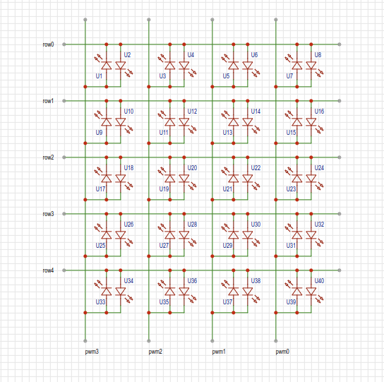

# led_mtrx_40

## Overview
I made 40 LEDs shine on arduino.

The configuration is a 4x5 matrix.
Four PWM signals are used to create high frequencies with timer0 and timer1.
The 4x5 matrix can be connected to 20 LEDs. In addition, 20 LEDs with opposite polarity are connected to make a total of 40 LEDs.

